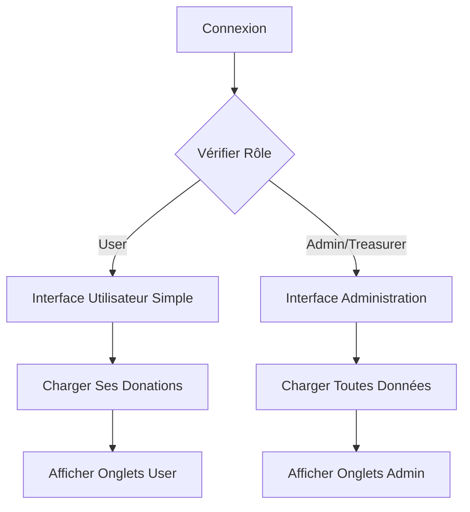

# Guide des Permissions - PartenaireMAGB

## ✅ Corrections Apportées

### Problème Initial
Les utilisateurs normaux recevaient une erreur 403 en tentant d'accéder à la page "Mes Donations" car l'interface tentait d'accéder à des ressources d'administration.

### Solutions Implémentées

#### 1. 🔧 Backend - Modèles et Validation
- **Profile.js** : Suppression des champs `required` non essentiels
- **User.js** : Validation renforcée contre les valeurs NaN
- **Payment.js** : Validation du champ `amount`
- **authController.js** : Création automatique de profil à l'inscription

#### 2. 🎨 Frontend - Interface Adaptative
- **index.js** : Interface différenciée selon les rôles
- **Formulaire d'inscription** : Collecte toutes les données requises
- **Gestion des erreurs 500** : Retry automatique avec backoff exponentiel
- **Notifications intelligentes** : Feedback contextuel selon l'état

#### 3. 🔐 Permissions par Rôle

| Fonctionnalité | User | Moderator | Treasurer | Admin |
|----------------|------|-----------|-----------|-------|
| Voir ses donations | ✅ | ✅ | ✅ | ✅ |
| Créer donations | ✅ | ✅ | ✅ | ✅ |
| Voir toutes donations | ❌ | ✅ | ✅ | ✅ |
| Gestion paiements | ❌ | ❌ | ✅ | ✅ |
| Vérifier paiements | ❌ | ❌ | ✅ | ✅ |
| Admin dashboard | ❌ | ❌ | ❌ | ✅ |

## 🧪 Test des Permissions

### Test Automatique
```bash
cd PartenaireMAGB-backend
node scripts/testUserPermissions.js
```

### Test Manuel

#### 1. Créer un Utilisateur Normal
```bash
curl -X POST http://localhost:5000/api/auth/register \
  -H "Content-Type: application/json" \
  -d '{
    "firstName": "Jean",
    "lastName": "Utilisateur",
    "email": "jean.user@example.com",
    "phone": "+2250779038001",
    "password": "password123",
    "country": "CI",
    "city": "Abidjan"
  }'
```

#### 2. Se Connecter
```bash
curl -X POST http://localhost:5000/api/auth/login \
  -H "Content-Type: application/json" \
  -d '{
    "email": "jean.user@example.com",
    "password": "password123"
  }'
```

#### 3. Tester l'Accès aux Donations (✅ Autorisé)
```bash
curl -X GET http://localhost:5000/api/donations \
  -H "Authorization: Bearer YOUR_TOKEN"
```

#### 4. Tester l'Accès aux Paiements (❌ Interdit)
```bash
curl -X GET http://localhost:5000/api/payments \
  -H "Authorization: Bearer YOUR_TOKEN"
# Devrait retourner 403 Forbidden
```

## 🎯 Interface Utilisateur

### Pour les Utilisateurs Normaux
- **Titre** : "Mes Donations"
- **Onglets** :
  - Mes Donations
  - Mes Donations Récurrentes  
  - Mes Statistiques
- **Actions** : Créer, Voir détails
- **Données** : Seulement ses propres donations

### Pour les Admins/Trésoriers
- **Titre** : "Administration des Donations"
- **Onglets** :
  - Toutes les Donations
  - Gestion des Paiements
  - Donations Récurrentes Globales
  - Statistiques Globales
- **Actions** : Toutes + Vérification paiements
- **Données** : Toutes les donations

## 🛠️ Débogage

### Vérifier le Rôle d'un Utilisateur
```javascript
// Dans MongoDB
db.users.findOne({email: "user@example.com"}, {role: 1, firstName: 1, lastName: 1})
```

### Promouvoir un Utilisateur en Admin
```javascript
// Dans MongoDB
db.users.updateOne({email: "user@example.com"}, {$set: {role: "admin"}})
```

### Logs Utiles
```bash
# Côté backend
console.log('User role:', req.user.role)
console.log('Required roles:', allowedRoles)

# Côté frontend  
console.log('isAdmin:', isAdmin)
console.log('isTreasurer:', isTreasurer)
console.log('isAdminUser:', isAdminUser)
```

## 🚨 Points d'Attention

### Sécurité
- Les permissions sont vérifiées côté backend ET frontend
- Les tokens JWT contiennent le rôle de l'utilisateur
- Les routes sensibles nécessitent `authorizeRoles()`

### Performance
- Les données sont filtrées côté serveur
- Pas de chargement inutile pour les utilisateurs normaux
- Cache des permissions côté frontend

### UX
- Interface adaptée selon le rôle
- Messages d'erreur clairs
- Retry automatique des requêtes échouées

## 🔄 Workflow de Connexion



## 📞 Support

En cas de problème :
1. Vérifier les logs backend
2. Tester avec le script de permissions
3. Vérifier le rôle en base de données
4. Contrôler les tokens JWT

---

**Note** : Ces corrections garantissent que les utilisateurs normaux peuvent accéder à leurs propres données sans erreur 403, tout en préservant la sécurité pour les fonctions d'administration. 